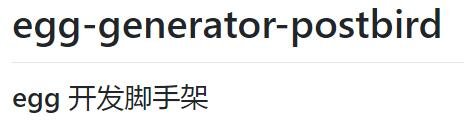

# egg-generator-postbird

## 说明

在 egg-init `simple` 的基础上对目录结构和一些内容进行重新组织和完善。

## 脚手架变动部分

- 使用 `egg-router-plus` 进行路由控制，增加 `./app/router` 文件夹存放路由文件
- 为 `app/public` 文件夹增加 `css/js/img/upload` 等文件夹，并默认生成 `app.css/app.js` 文件，同时附带 `bootstrap V4`（jquery-3.2.1） 的相关依赖。
- 完善 `egg-view-nunjucks` 的模板，并且附带 nunjucks 的模板继承布局。
- 去掉了 `eslint` ，默认不进行风格检查。


## 开发和部署



### 克隆项目

```bash
git clone https://github.com/postbird/egg-generator-postbird.git
```
### 安装依赖

```bash
yarn install
# npm install 
```

### 本地开发

```bash
$ npm i
$ npm run dev
$ open http://localhost:7001/
```

### 部署

```bash
$ npm start
$ npm stop
```

## License

MIT

